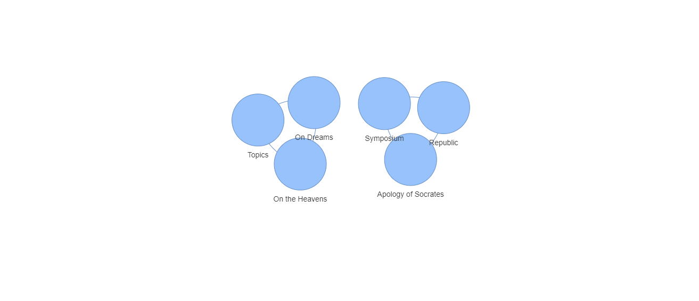

Usage
=====

Create & manage hierarchical data
---------------------------------

This example employs a template to generate sample data:

.. code-block:: python

    from indexia.eidola import Templates
    
    db = 'test.db'
    generator = Templates(db)
    generator.show_templates()
    objects = generator.build_template('philosophy')
    
The ``build_template`` method of ``eidola.Templates`` creates & populates 
several database tables with hierarchical relationships. The hierarchy of 
tables in ``'philosophy'`` & other available templates is illustrated by the 
``show_templates`` method. To generate tables & data from scratch, use the 
``add_creator`` & ``add_creature`` methods of ``indexia.Indexia``:

.. code-block:: python
    
    from indexia.indexia import Indexia
    
    with Indexia(db) as ix:
        cnxn = ix.open_cnxn(ix.db)
        
        homer = ix.add_creator(
            cnxn=cnxn, 
            genus='poets', 
            trait='name', 
            expr='Homer'
        )
        
        iliad = ix.add_creature(
            cnxn=cnxn, 
            genus='poets', 
            creator=homer, 
            species='epics', 
            trait='title', 
            expr='The Iliad'
        )

Once objects have been generated, they can be updated & managed with 
``indexia.Indexia``:

.. code-block:: python

    from indexia.indexia import Indexia
    
    philosophers = objects['philosophers']
    aristotle = philosophers[philosophers.name == 'Aristotle']
    
    with Indexia(db) as ix:
        cnxn = ix.open_cnxn(ix.db)
    
        works_of_aristotle = ix.get_creatures(
            cnxn=cnxn,
            genus='philosophers',
            creator=aristotle
        )
        
        table, data = works_of_aristotle[0]
        on_the_soul = data[data.title == 'On the Soul']
        work_id = on_the_soul.id.values[0]
        
        works_deleted = ix.delete(
            cnxn=cnxn,
            species=table,
            entity_id=work_id
        )
        
        assert(works_deleted == 1)

        on_dreams = ix.add_creature(
            cnxn=cnxn, 
            genus='philosophers',
            creator=aristotle, 
            species='works',
            trait='title', 
            expr='On Dreams'
        )

        dreams = ix.add_creature(
            cnxn=cnxn, 
            genus='works',
            creator=on_dreams, 
            species='topics',
            trait='name', 
            expr='dreams'
        )

Inpect & display data
---------------------
  
To view the full data hierarchy under a given set of creator entities, create 
a dataframe using ``schemata.Corpus``:

.. code-block:: python

    from indexia.schemata import Corpus
    
    corpus = Corpus(
        db=db, 
        genus='philosophers', 
        creators=philosophers
    ).assemble()
    
Relationships between ``indexia`` objects can be visualized as a network graph
using ``schemata.Diktua``:

.. code-block:: python

    from indexia.schemata import Diktua
    
    works = corpus[corpus.species == 'works']
    
    diktua = Diktua(
        corpus=works, 
        as_nodes='expression', # nodes represent work titles
        as_edges='creator_id'  # edges represent shared authorship 
    )
    
    diktua.style_nodes()
    diktua.plot(plot_path='diktua.html')
    
Open ``diktua.html`` in a web browser to load the interactive network graph.

  
**Note:** ``schemata.Diktua`` uses ``pyvis`` for plotting, which can be slow 
for large or well-connected graphs. Performance improvements may be made in 
future releases.
    
``indexia`` data can also be represented as XML using ``schemata.Dendron``:

.. code-block:: python

    from indexia.schemata import Dendron
    
    dendron = Dendron(db)
    
    image = dendron.render_image(
        genus='philosophers', 
        creators=philosophers
    )
    
    dendron.write_image(
        image, 
        file_path='dendron.xml', 
        open_browser=True
    )
    
The ``render_image`` method of ``schemata.Dendron`` creates an XML tree of 
``indexia`` data, which can be saved & opened in a browser window with 
``write_image``. The tree created for the ``'philosophy'`` template data 
looks like this:

.. code-block:: xml
    
    <root>
        <philosophers id="1" name="Plato">
            <works id="1" title="Apology of Socrates" philosophers_id="1">
                <topics id="1" name="civics" works_id="1"/>
            </works>
            <works id="2" title="Symposium" philosophers_id="1">
                <topics id="2" name="love" works_id="2"/>
            </works>
            <works id="3" title="Republic" philosophers_id="1">
                <topics id="3" name="civics" works_id="3"/>
            </works>
        </philosophers>
        <philosophers id="2" name="Aristotle">
            <works id="4" title="On the Heavens" philosophers_id="2">
                <topics id="4" name="cosmology" works_id="4"/>
            </works>
            <works id="5" title="Topics" philosophers_id="2">
                <topics id="5" name="logic" works_id="5"/>
            </works>
            <works id="7" title="On Dreams" philosophers_id="2">
                <topics id="7" name="dreams" works_id="7"/>
            </works>
        </philosophers> 
    </root>
    
Custom workflows
----------------

The methods of ``indexia`` modules can be wrapped in other functions to create 
workflows for your projects. Below is an example of a script to add cards to a 
Zettelkasten project. Running this script from a command line tool gives a 
minimalist interface for creating project data. Other frameworks & applications
can be leveraged to make full-fledged applications.

.. code-block:: python

    from indexia.indexia import Indexia

    def get_library(ix, cnxn, scribe, libronym):
        _, libraries = ix.get_creatures(cnxn, 'scribes', scribe)[0]
        library = libraries[libraries.libronym == libronym]
        
        return library

    def add_card(ix, cnxn):
        pseudonym = input('enter scribe pseudonym: ')
        libronym = input('enter library libronym: ')
        created = input('enter card datetime: ')
        keywords = input('enter semi-colon-separated keywords: ')
        keywords = keywords.split(';')
        
        scribe = ix.get_by_trait(cnxn, 'scribes', pseudonym)
        library = get_library(ix, cnxn, scribe, libronym)
        
        card = ix.add_creature(
            cnxn, 'libraries', library, 'cards', 'created', created
        )
            
        for k in keywords:
            ix.add_creature(
                cnxn, 'cards', card, 'logonyms', 'logonym', k    
            )
        
        return card

    def main():
        db = 'indexia.db'
        
        with Indexia(db) as ix:
            cnxn = ix.open_cnxn(db)
            card = add_card(ix, cnxn)
            
        return card

    if __name__ == '__main__':
        card = main()